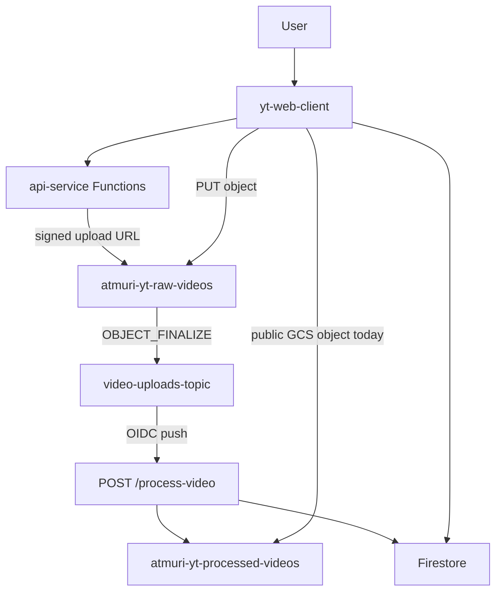
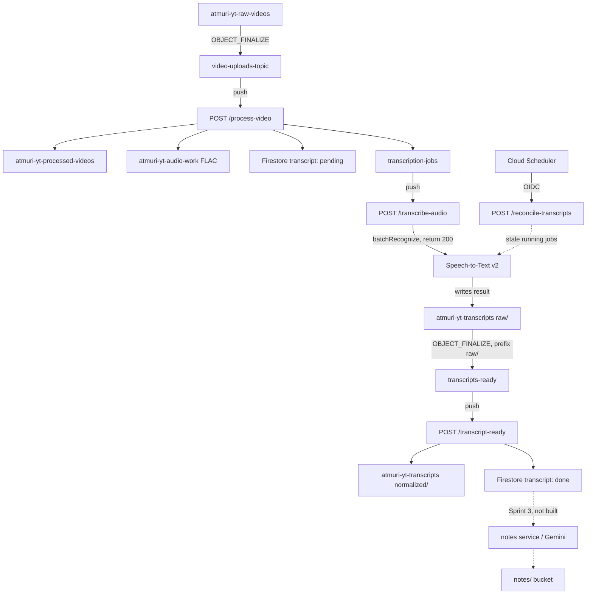

# CloudScribe AI

CloudScribe AI is a GCP-native pipeline that turns lecture and other video content into transcripts, AI study notes, a RAG index, and a grounded study chatbot.

It began as a YouTube-style video hosting clone. That lineage is why some names still say `yt` — `yt-web-client`, the `atmuri-yt-*` buckets, and GCP project `yt-clone-385f4` (display name `cloudscribe-ai`). Those names are historical, not a product claim.

**What works today:** a signed-URL upload path, Pub/Sub-triggered transcoding, processed playback, and Firebase auth. That is Sprint 1, and it is deployed.

**What it is aiming to be:** the same upload path, plus batch Speech-to-Text, generated notes, a retrieval index over the user's own material, and a citation-backed study chat. Sprint 2 (event-driven Speech-to-Text v2) is **merged and deployed** to Cloud Run, gated off (`ENABLE_TRANSCRIPTION=false` on revision `video-processing-service-00016-m9z`). Transcription infrastructure (buckets, topics, push/DLQ subscriptions, prefix-filtered GCS notification, Cloud Scheduler job `reconcile-transcripts` every 15 minutes) **exists** in `yt-clone-385f4` and `scripts/setup-transcription-infra.sh` was verified idempotent. Transcription itself remains off: no Speech call has been made and no real Speech v2 output has been observed. The new buckets also carry GCP's default 7-day soft delete, which the script did not set. Sprints 3–6 exist as specs; Sprint 6 (live transcription) is a committed architectural direction, not a stretch goal — see [`docs/features/sprint-06-live-transcription.md`](docs/features/sprint-06-live-transcription.md).

This is not a public video host, and it is not finished.

## Current architecture (deployed)

Three services, plus Firebase Auth / Firestore / Cloud Storage / Pub/Sub:

1. **`yt-web-client`** — Next.js UI for sign-in, upload, and watch. Deployed as Cloud Run service `cloudscribe-ai` (public ingress).
2. **`api-service`** — Firebase Functions (2nd gen, also Cloud Run) that mint signed upload URLs and list videos.
3. **`video-processing-service`** — Express worker on Cloud Run. Ingress is **`--ingress=internal`**. It is not on the public internet. Hitting its `.run.app` URL from a browser or an external uptime checker returns a Google-frontend 404 by design.



The worker URL `https://video-processing-service-rfrkdig5jq-uc.a.run.app` is real, but only reachable from inside the project (Pub/Sub push, Cloud Scheduler, other GCP services). It is not a public health check. See [Known limitations](#known-limitations) and [`docs/monitoring-setup.md`](docs/monitoring-setup.md).

## Target architecture (Sprint 2 onward)

Sprint 2 does **not** add a fourth running service. Transcription is inside `video-processing-service` as an event-driven Speech-to-Text v2 pipeline: `batchRecognize` writes JSON under a `raw/` prefix, a prefix-filtered bucket notification completes the job, and a scheduler sweeper records failures. Processing strategy is configurable via `SPEECH_PROCESSING_STRATEGY` (Cloud Build `_SPEECH_PROCESSING_STRATEGY`). The **deployed/test default is `STANDARD`** (Speech `PROCESSING_STRATEGY_UNSPECIFIED`: process as soon as received, ~$0.016/min, minutes-scale). **`DYNAMIC_BATCHING`** is ~5× cheaper (~$0.003/min) with a 24-hour fulfillment ceiling — required for production launch, unusable while iterating. There is no synchronous polling; Pub/Sub's ack deadline is 600s and cannot cover a long Speech job.

Live transcription (Sprint 6) is a committed direction that will produce the **same transcript document**. Nothing downstream of that document (notes, indexing, chat) may depend on how the transcript was produced. See [`docs/features/sprint-06-live-transcription.md`](docs/features/sprint-06-live-transcription.md).



Sprint 3 adds a dedicated **notes service**. Sprint 4 indexes into Firestore `findNearest` (not Vertex AI RAG Engine). Sprint 5 is grounded chat. Sprint 6 is live transcription as another producer of the same transcript document.

Two design constraints that matter for cost and correctness:

- Normalized transcript output must **not** be written under the notification-watched `raw/` prefix, or Speech completion retriggers itself in a billed loop.
- Event-driven completion only observes success. Failed Speech jobs write no object, so `/reconcile-transcripts` is required.

## Services

| Service | Role | Status |
| --- | --- | --- |
| `yt-web-client` | Next.js UI. Cloud Run service name `cloudscribe-ai`. | Deployed |
| `api-service` | Firebase Functions: signed upload URLs, video listing, scoped `getTranscriptUrl`. | Deployed (`getTranscriptUrl` is live as Cloud Run service `gettranscripturl`; Speech path is gated off) |
| `video-processing-service` | Transcode worker + gated transcription worker. Internal ingress. | Sprint 1 + Sprint 2 **code deployed**; `ENABLE_TRANSCRIPTION=false` on revision `video-processing-service-00016-m9z`. Infra exists and was verified idempotent; transcription remains gated. |
| Notes service | Cloud Run worker: transcript → Gemini → notes in GCS + Firestore | Specified only (Sprint 3) |

Later specified services (not started): Firestore `findNearest` indexer (Sprint 4), study chatbot (Sprint 5), live transcription (Sprint 6, committed direction).

## Roadmap

Specs live under [`docs/features/`](docs/features/). Status below is operational, not aspirational.

| Sprint | Intent | Status |
| --- | --- | --- |
| **1** | Stabilize upload → Pub/Sub → transcode → Firestore | **Done and deployed.** Smoke path, health endpoint (internal), Cloud Build triggers, env docs. See [`docs/features/SPRINT-01-COMPLETION.md`](docs/features/SPRINT-01-COMPLETION.md). |
| **2** | Batch Speech-to-Text v2, transcript GCS + Firestore, fetch API + watch UI | **Merged and deployed, gated off.** Event-driven v2 design. `ENABLE_TRANSCRIPTION` defaults **off** (Cloud Build `_ENABLE_TRANSCRIPTION="false"`). Infra exists (verified idempotent). Cloud Scheduler `reconcile-transcripts` is ENABLED every 15 minutes. No Speech call has been made; no real Speech v2 output has been observed. |
| **3** | Notes service on Vertex AI Gemini | **Specified only.** [`docs/features/sprint-03-notes.md`](docs/features/sprint-03-notes.md) |
| **4** | Chunk + index into Firestore `findNearest` (exact KNN, no standing cost) with `text-embedding-005` at 768 dimensions | **Specified only.** [`docs/features/sprint-04-rag-indexing.md`](docs/features/sprint-04-rag-indexing.md) — Vertex AI RAG Engine / Vector Search was ruled out on standing cost. `gemini-embedding-001` defaults to 3072 dimensions, which exceeds Firestore's 2048 limit. |
| **5** | Grounded study chatbot with citations | **Specified only.** [`docs/features/sprint-05-study-chatbot.md`](docs/features/sprint-05-study-chatbot.md) |
| **6** | Browser-mic live transcription into the same transcript document (then notes/RAG) | **Specified; committed direction.** [`docs/features/sprint-06-live-transcription.md`](docs/features/sprint-06-live-transcription.md) |

An architecture write-up from the `sprint1` branch (`docs/features/02-cloudscribe-architecture-evolution.md`) described a separate transcription Cloud Run service. The Sprint 2 rebuild superseded that: transcription stays in `video-processing-service`.

## Run locally

You need Node.js 22 (Functions engine), npm, `ffmpeg` on `PATH` (the worker shells out through `fluent-ffmpeg`), and Application Default Credentials for anything that talks to GCS/Firestore. Copy each service's `.env.example` and fill it in. Full variable lists: [`docs/environment-configuration.md`](docs/environment-configuration.md).

The practical loop used so far is **local web client + deployed Functions + deployed (internal) worker**. The worker is triggered by GCS → Pub/Sub, not by opening its URL.

### Web client

```bash
cd yt-web-client
cp .env.example .env.local   # then set the NEXT_PUBLIC_* values
npm install
npm run dev
```

UI: [http://localhost:3000](http://localhost:3000).

`NEXT_PUBLIC_VIDEO_PROCESSOR_URL` is leftover from when `/health` was treated as public. Leave it unset. The processor is internal-only.

### API (Firebase Functions)

```bash
cd api-service/functions
cp .env.example .env
npm install
npm run build
```

Emulators: `npm run serve` (builds, then `firebase emulators:start --only functions`). Signed-URL issuance against real GCS still needs credentials and bucket IAM.

Deploy to the shared project (this is what the smoke test currently assumes):

```bash
cd api-service
firebase deploy --only functions
```

### Video processing worker

```bash
cd video-processing-service
cp .env.example .env
npm install
npm test
npm start
```

Local `npm start` runs Express via `ts-node`. It will not receive production Pub/Sub pushes unless you point a subscription at it, which you should not do against the shared project. For the real path, upload through the client or [`scripts/smoke-test.sh`](scripts/smoke-test.sh) and watch Cloud Run logs.

End-to-end smoke (deployed Functions + worker): [`docs/smoke-test-guide.md`](docs/smoke-test-guide.md).

## Deploy

Two Cloud Build triggers fire on **push to `main`** only (`^main$`):

| Trigger | Config | Cloud Run service |
| --- | --- | --- |
| `video-processing-service` | [`video-processing-service/cloudbuild.yaml`](video-processing-service/cloudbuild.yaml) | `video-processing-service`, `--ingress=internal`, 2Gi / 1 CPU, max 1 instance |
| `web-client` | [`yt-web-client/cloudbuild.yaml`](yt-web-client/cloudbuild.yaml) | `cloudscribe-ai`, public |

Each build: Docker image for `linux/amd64` → Artifact Registry → `gcloud run deploy`. Builds use `E2_STANDARD_2` (the 2,500-minute free SKU). Details: [`docs/cloud-build-setup.md`](docs/cloud-build-setup.md).

Functions are **not** on those triggers. Deploy them from `api-service` with `firebase deploy --only functions`.

Sprint 2 code is already on `main` and on Cloud Run, with `ENABLE_TRANSCRIPTION` defaulting **off**. The flag is set explicitly via the Cloud Build substitution `_ENABLE_TRANSCRIPTION` (also `"false"`). Transcription buckets, topics, subscriptions, the `raw/` GCS notification, and Cloud Scheduler `reconcile-transcripts` (every 15 minutes) **exist** and the setup script was verified idempotent. Remaining sequence: keep the flag off until the gated sweeper is deployed, set `_SPEECH_PROCESSING_STRATEGY=DYNAMIC_BATCHING` (the code default is `STANDARD`, 5× the batch price), then flip `_ENABLE_TRANSCRIPTION=true`. Transcription has not been exercised end to end — no Speech call has been made.

Manual scripts (`video-processing-service/deploy.sh`, `yt-web-client/deploy.sh`) still exist; Cloud Build is the path that actually ships `main`.

## Known limitations

Documented tradeoffs: [`docs/project-limitations.md`](docs/project-limitations.md). The important ones:

- **`/health` is not externally reachable.** Ingress is internal. Cloud Run's own startup probe (TCP on 8080) is what keeps the revision up. External Monitoring uptime checks against the `.run.app` host will look like an outage. [`docs/monitoring-setup.md`](docs/monitoring-setup.md) used to recommend that; it now flags the contradiction.
- **Pub/Sub ack is 600s.** A transcode that runs longer can be redelivered. Firestore status gating reduces duplicates; it does not eliminate the race.
- **Processed videos are public GCS objects** (`makePublic()`). Playback works; object ACLs do not. Signed video URLs and owner-only Firestore rules are a planned security pass, not done.
- **`allUsers` can still invoke the worker** in addition to the Pub/Sub service account. Combined with internal ingress this is less exposed than a public URL, but it is not least-privilege.
- **Raw uploads are never deleted** in GCS (`deleteRawVideo` removes the local temp file only).
- **No HLS/DASH, no CDN.** One `us-central1` bucket, one rendition.
- **Video id is the object filename.** Fine for the clone; brittle for hyphenated UIDs and dotted names (Sprint 2 keeps main's safer filename parsing).
- **`Video` TypeScript types are copy-pasted** across client, Functions, and worker.
- **Sprint 2 infra exists** (buckets, push/DLQ subscriptions, prefix-filtered notification, scheduler every 15 minutes) and was verified idempotent. `ENABLE_TRANSCRIPTION` stays **off**. No Speech call has been made. New buckets also have GCP's default 7-day soft delete (not set by the script). Flip the flag only after `_SPEECH_PROCESSING_STRATEGY=DYNAMIC_BATCHING` is set for lecture audio.

## Keep docs current

When a change affects behavior, cost, or sprint status, update **README**, the relevant [`docs/features/sprint-*.md`](docs/features/), and [`docs/cost-and-credits.md`](docs/cost-and-credits.md) **in the same PR**. Stale docs are a defect.

## Cost

Rough envelope, current billing facts, and the Sprint 4 standing-cost trap: [`docs/cost-and-credits.md`](docs/cost-and-credits.md).

## Reference docs

- [`docs/environment-configuration.md`](docs/environment-configuration.md) — env vars, APIs, service accounts
- [`docs/pubsub-architecture.md`](docs/pubsub-architecture.md) — upload → process path
- [`docs/pubsub-iam-audit.md`](docs/pubsub-iam-audit.md) — topic/subscription IAM
- [`docs/monitoring-setup.md`](docs/monitoring-setup.md) — log-based alerts; do not use external `/health` uptime checks
- [`docs/cloud-build-setup.md`](docs/cloud-build-setup.md) — triggers
- [`docs/smoke-test-guide.md`](docs/smoke-test-guide.md) — upload smoke test
- [`docs/cost-and-credits.md`](docs/cost-and-credits.md) — GCP cost and credit-offer notes
- [`docs/project-limitations.md`](docs/project-limitations.md) — tradeoffs
