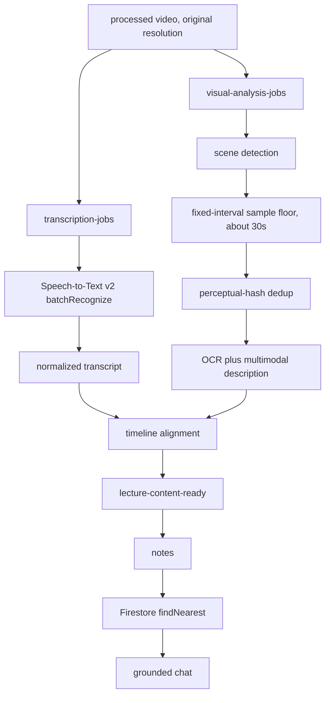

# Time-aligned multimodal lecture-content model

**Status:** agreed design direction. Documentation only. Nothing in this document is implemented.

This is the downstream contract for notes (Sprint 3), retrieval (Sprint 4), and grounded chat (Sprint 5). Visual processing is not built. Notes are not built. Transcription (Sprint 2) is deployed and gated off; no Speech-to-Text call has been made, and no real Speech v2 result file has been observed. The existing transcript parser is validated against Google’s documented JSON shape, not against production output.

## Vocabulary (locked)

The code already keys media as `videoId` and tags producers as `source: "batch" | "live"` (`TranscriptDocument` in `video-processing-service`, GCS paths `raw/{videoId}/…`, watch URLs, Sprint 4 chunk sketches). This design **does not introduce `lectureId`**. A lecture-content document is identified by the same `videoId` as the video and transcript.

| Concept | Field | Why |
| --- | --- | --- |
| Identity | `videoId` | Matches Firestore `videos/{videoId}`, transcript payloads, and chunk metadata. |
| Producer | `source`: `"batch"` \| `"live"` | Same discriminator as `TranscriptSource`. Downstream must not branch on it. |
| Spoken words on a segment | `text` | Matches `ITranscriptSegment.text`. The proposal’s segment field `transcript` is **not** used; `transcript` already names the audio artifact. |

The product name for the document is the **lecture-content model**. The identifier is still `videoId`.

## Core change

The downstream contract evolves from a normalized **transcript** into a time-aligned **lecture-content model**. The transcript remains the authoritative audio representation. It becomes one modality alongside visual evidence (slides, diagrams, equations, charts, demonstrations).

### Shape

```json
{
  "videoId": "uid-1234567890",
  "source": "batch",
  "segments": [
    {
      "startTime": 12.4,
      "endTime": 28.1,
      "text": "the derivative of x squared is 2x",
      "visuals": [
        {
          "imageUri": "gs://…/frames/uid-1234567890/00028.jpg",
          "ocrText": "d/dx x² = 2x",
          "description": "Whiteboard derivation of the power rule, two lines."
        }
      ]
    }
  ]
}
```

`visuals` may be empty. That is the transcript-only form, and it is both the **first implementation milestone** and the **permanent fallback** when visual analysis fails.

Storage is not implemented. The intended split, matching transcripts, is:

- Firestore `videos/{videoId}` (or a sibling doc under that video) holds per-stage status and pointers.
- A GCS JSON object holds the full lecture-content payload, analogous to `normalized/{videoId}/{transcriptId}.json`.

Exact collection layout is an implementation detail of step 1 below. Do not invent a second identifier.

## Invariant (replaces the transcript-only contract)

**Old:** all consumers depend on the transcript document.

**New:** all downstream consumers depend on the normalized lecture-content model and remain independent of the audio or visual producer that created each artifact.

Consequences:

- Notes, indexing, and chat read lecture-content, not raw Speech JSON and not raw frames.
- `source` (`batch` | `live`) is a producer tag, not a fork in the pipeline. Do not add a second notes path, a second indexer, or a second chat corpus keyed on transport.
- The transcript document still exists. It is the audio producer’s artifact. It is not the contract that Sprints 3–5 consume once the lecture-content model exists.

Sprint 6 (live) is another producer of the same model, deferred until visual handling exists. See [sprint-06-live-transcription.md](sprint-06-live-transcription.md).

## Target flow

Audio and video are processed **concurrently** as separate Pub/Sub jobs after transcode. Transcode stays first: both jobs need the processed object (original resolution; see [constraint](#3-original-resolution-is-load-bearing-for-ocr)). Audio goes to asynchronous Speech-to-Text. Video goes to scene detection, then keyframes, then OCR and visual description. A timeline-alignment step emits `lecture-content-ready`, which feeds notes, then retrieval, then grounded chat.



None of the visual, assembler, notes, retrieval, or chat boxes exist in the running system. The audio boxes exist as gated Sprint 2 code and provisioned infra; they have never completed a Speech job.

**Rejected default:** repeated full-video multimodal model calls. Reusable visual artifacts (stored frames + OCR + descriptions) are cheaper, citable, and decouple notes from raw media.

## Per-stage reliability

Each stage gets its own idempotent claim and status, mirroring the transcription claim already implemented (`pending` → `running` only from a successful claim; `needs_review` when an external side effect may or may not have occurred; terminal states are not re-claimed).

| Field | Stage | Role |
| --- | --- | --- |
| `transcriptionStatus` | Speech job (exists today as transcript `status`) | Audio producer. Terminal values today include `done`, `failed`, `needs_review`, `no_audio_detected`. |
| `visualAnalysisStatus` | Scene detect → frames → OCR/description | Visual producer. Failure here must **not** strand the lecture. |
| `contentAssemblyStatus` | Timeline alignment | Emits `lecture-content-ready` when required inputs are terminal. |
| `notesStatus` | Gemini notes | Consumes lecture-content. |
| `indexingStatus` | Chunk + embed + `findNearest` | Consumes lecture-content (and notes). |

Claim semantics to copy from transcription:

- Only `pending` may be claimed into `running`.
- `failed` means the external call definitely never started, or it completed with a recorded error.
- `needs_review` is **terminal for automatic retries** when the side effect is ambiguous (timeout after an RPC that may have been accepted, persist failure after accept). A human or a sweeper adjudicates. Do not start a second billed OCR/description job from this state.
- Visual `failed` or `needs_review` still allows assembly: notes degrade to **transcript-only**.

The assembler emits `lecture-content-ready` when required inputs reach terminal states. **Required** for a usable lecture-content document: transcription `done` (normalized segments exist). **Optional:** visual analysis `done`. Visual `failed` / `needs_review` / not-yet-built → assemble with empty `visuals`.

Transcription `failed` or `no_audio_detected` is **not** decided as a visual-only success path. Silent screen recordings already have a terminal transcript status with no signed artifact. Whether assembly should still emit a visuals-only model is open; do not assume it.

## Recommended technical decisions

1. **Extract scene-change keyframes with FFmpeg**, not every frame. The worker already shells out to ffmpeg for transcode.
2. **Deduplicate similar slides and cap sampling** for cost control. Dedup is by perceptual hash **before** OCR and description, not after. Placement matters: dedup after analysis multiplies cost by the number of near-duplicates.
3. **Store frames in Cloud Storage** with timestamps and ownership metadata (`videoId`, `uid`, capture time). Frames are not public playback objects; they are study artifacts. Access must follow the planned owner-only security pass (the repo currently has **no** Firestore security rules; processed videos are `makePublic()`).
4. **Run OCR plus multimodal descriptions** so diagrams and non-text visuals are captured, not only slide text.
5. **Keep text embeddings initially** (`text-embedding-005` at 768 dimensions into Firestore `findNearest`). Defer native image embeddings until visual similarity search is justified. That is a new retrieval question, not a change to the locked Sprint 4 index.
6. **Citations reference both video timestamps and extracted frames.**
7. **Do not** make repeated full-video multimodal calls the default.

These are design choices, not deployed behavior.

## Implementation order (decided)

Define the schema now, then build notes from transcript only, and only then add the visual pipeline.

Rationale: the aggregation state machine (timeline assembly across independent producers) is the most complex component in the system. Building it before anything consumes its output means debugging blind. Building notes-from-transcript first reveals both whether transcript-only notes are already adequate for some content and exactly what is missing when they are not.

| Step | What to build | What not to build yet |
| --- | --- | --- |
| 1 | Schema and per-stage status transitions (`transcriptionStatus` already exists; add the others as fields, not as a live assembler) | Visual jobs, assembler fan-in |
| 2 | Notes from transcript (lecture-content with empty `visuals`) | Keyframes, OCR |
| 3 | Keyframe extraction and storage | OCR/description spend |
| 4 | OCR and visual description | Treating visuals as required |
| 5 | Timeline assembly with transcript-only fallback | Live capture |
| 6 | Enriched retrieval chunks and citations (text + OCR + descriptions + timestamps + frame refs) | Image embedding index |
| 7 | Extend the producer model to live capture | Shipping Sprint 6 as the first visual path |

Step 1 is **schema + status fields**, not the full assembler. The assembler is step 5, after notes already consume transcript-only lecture-content.

## Review findings (agreed; not optional)

The proposal is qualified by the following. Do not implement as if they were undecided commentary.

### 1. Sequencing (decided)

Recorded above. Schema now, notes from transcript next, visual pipeline after notes exist as a consumer. The assembler is not the first thing to build.

### 2. Scene detection is the main technical risk

Naive FFmpeg scene thresholds fail in both directions on lecture video.

**Worked example (under-sampling).** A slide stays on screen for ten minutes while the lecturer annotates a derivation. Scene detection sees one cut and emits one keyframe at the first appearance. The OCR/description then describes a blank theorem statement. The whole derivation is lost.

**Worked example (over-sampling).** A talking-head inset in the corner gestures every second; each gesture is a scene change. A scrolling terminal is continuous change. Naive detection emits hundreds of near-duplicate frames and the OCR/description bill follows the frame count.

Mitigations:

- Combine scene detection with a **fixed-interval sample floor** (roughly every 30 seconds) so slow evolution is still captured.
- **Deduplicate by perceptual hash before paying for OCR and description**, not after.

The 30-second floor is a starting bound, not a measured optimum. The hash algorithm and similarity threshold are not chosen.

### 3. Original resolution is load-bearing for OCR

Original-resolution transcoding is now a **constraint**, not only a quality preference. Sprint 2 removed `-vf scale=-1:360` so the processed object (and the FLAC extracted from it) keep source resolution.

OCR on 360p slides is poor; equations become unreadable (a subscript or exponent is a few pixels). If anyone later reintroduces downscaling to reduce egress, OCR quality degrades **silently** — there is no error anywhere in the visual pipeline.

See [project-limitations.md](../project-limitations.md). The coupling must stay visible from both sides: transcode docs and this model.

### 4. Privacy risk class changes

Extracted frames are **images of course material**. They may be copyrighted. Room recordings may contain other students’ faces. That is a different risk class than transcripts (text of what was said).

The repo currently has **no Firestore security rules**. Processed playback objects are already public (`makePublic()`). Adding stored frames raises the cost of that existing gap: a leaked frame URL is a still of the lecture, not a sentence of transcript.

Cross-reference: README known limitations (signed video URLs and owner-only Firestore rules are a planned security pass, not done) and the raw-retention / public-object notes in [project-limitations.md](../project-limitations.md). Do not treat frame storage as safe because transcripts are “just text.”

### 5. Cost (estimates, not measured)

Roughly a **doubling** of per-lecture cost, from about **$0.18 to near $0.35**. These are planning estimates that need verification against current list prices. They are not invoices and not observed spend. Transcription itself has never run.

| Line | Estimate | Notes |
| --- | --- | --- |
| Batch transcription today | ~$0.18 / lecture-hour at `DYNAMIC_BATCHING` | ~$0.003/min; `STANDARD` is ~5×. No Speech job has been billed yet. |
| Keyframe extraction | Nearly free | ffmpeg already runs for transcode. |
| Frame storage | Trivial | Small JPEGs; not the cost driver. |
| OCR | A few cents per lecture after the free monthly allowance | Verify current Document AI / Vision list prices. |
| Multimodal descriptions | Cents per lecture on a Flash-class model; roughly **10×** that on a Pro-class model | Model class is not chosen. |

Do not budget Pro-class descriptions as the default. Do not treat $0.35 as a measured figure.

## Live capture (decided, and deferred)

The visual source for live sessions is **screen capture of a lecture on the student’s own screen** (`getDisplayMedia`), **not** a phone camera pointed at a projector.

**Why not a phone aimed at a projector.** Visual noise: keystone distortion, glare, heads in frame, autofocus hunting, motion blur. OCR degrades worst exactly where precision matters — a subscript or exponent is only a few pixels on a phone frame of a projected slide.

**Why screen capture is different.** Input is essentially PDF-quality, so optical noise is not the problem. The problems are product and platform:

- Browsers require an **explicit user gesture** and will not grant persistent capture.
- Sharing an **entire screen** rather than a single tab would ingest notifications and unrelated windows — a privacy exposure to design against (prefer tab capture).
- Support is effectively **desktop-only**.

**This scopes the live feature.** Live capture only earns its complexity for a **synchronous remote lecture** (a live Zoom / Teams / Meet class that cannot be re-downloaded). For an already-recorded video the student should upload the file and use the better batch path.

**In-person lectures fall outside the visual story.** Those students get audio-only live capture (microphone), or they record and upload afterward.

**Tab-audio upside.** Tab capture can take **tab audio** alongside video, giving cleaner lecture audio than a room microphone. The live path may actually have better transcription input than the batch path (which transcribes whatever was in the uploaded file).

**Live is explicitly deferred.** Design and build visual handling on the batch path first (steps 1–6). Revisit live sessions afterward (step 7). Sprint 6 stays specified-only. Details: [sprint-06-live-transcription.md](sprint-06-live-transcription.md).

## What this does not change

- Sprint 4 retrieval stays Firestore `findNearest` (exact KNN, no standing cost) with `text-embedding-005` at 768 dimensions. Vertex Vector Search / RAG Engine remain ruled out.
- Sprint 2 remains the audio producer: event-driven Speech-to-Text v2, gated off until deliberately enabled.
- No cloud resources, feature flags, or TypeScript change as part of recording this direction.
