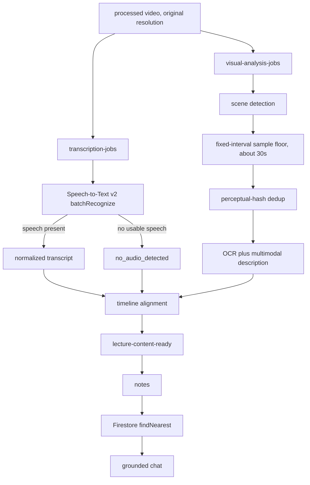

# Time-aligned multimodal lecture-content model

**Status:** agreed design direction. Documentation only. Nothing in this document is implemented.

This is the downstream contract for notes (Sprint 3), retrieval (Sprint 4), and grounded chat (Sprint 5). Visual processing is not built. Notes are not built. Transcription (Sprint 2) is deployed and gated off; no Speech-to-Text call has been made, and no real Speech v2 result file has been observed. The existing transcript parser is validated against Google’s documented JSON shape, not against production output.

## Vocabulary (locked)

The code already keys media as `videoId` and tags producers as `source: "batch" | "live"` (`TranscriptDocument` in `video-processing-service`, GCS paths `raw/{videoId}/…`, watch URLs, Sprint 4 chunk sketches). This design **does not introduce `lectureId`**. A lecture-content document is identified by the same `videoId` as the video and transcript.

| Concept | Field | Why |
| --- | --- | --- |
| Identity | `videoId` | Matches Firestore `videos/{videoId}`, transcript payloads, and chunk metadata. |
| Producer | `source`: `"batch"` \| `"live"` | Same discriminator as `TranscriptSource`. Downstream must not branch on it. |
| Spoken words on a segment | `text` | Matches `ITranscriptSegment.text`. The proposal’s segment field `transcript` is **not** used; `transcript` already names the audio artifact. |

The product name for the document is the **lecture-content model**. The identifier is still `videoId`.

## Core change

The downstream contract evolves from a normalized **transcript** into a time-aligned **lecture-content model**. The transcript remains the authoritative audio representation. It becomes one modality alongside visual evidence (slides, diagrams, equations, charts, demonstrations).

### Shape

```json
{
  "videoId": "uid-1234567890",
  "source": "batch",
  "segments": [
    {
      "startTime": 12.4,
      "endTime": 28.1,
      "text": "the derivative of x squared is 2x",
      "visuals": [
        {
          "imageUri": "gs://…/frames/uid-1234567890/00028.jpg",
          "ocrText": "d/dx x² = 2x",
          "description": "Whiteboard derivation of the power rule, two lines."
        }
      ]
    }
  ]
}
```

Either modality may be empty. That is how the two permanent fallbacks are represented:

- **`visuals` empty** — transcript-only. First implementation milestone, and the permanent fallback when visual analysis fails or has not been built yet.
- **`text` empty** — visual-only. Permanent fallback when transcription is `no_audio_detected` and visual analysis produced usable content. Notes generate from OCR text and visual descriptions alone.

Both empty is the genuinely empty lecture: no speech and no usable visuals. That is the only true dead end, and it must surface to the user as empty content rather than as a pipeline error.

Storage is not implemented. The intended split, matching transcripts, is:

- Firestore `videos/{videoId}` (or a sibling doc under that video) holds per-stage status and pointers.
- A GCS JSON object holds the full lecture-content payload, analogous to `normalized/{videoId}/{transcriptId}.json`.

Exact collection layout is an implementation detail of step 1 below. Do not invent a second identifier. The layout question is still [open](#open-questions).

## Invariant (replaces the transcript-only contract)

**Old:** all consumers depend on the transcript document.

**New:** all downstream consumers depend on the normalized lecture-content model and remain independent of the audio or visual producer that created each artifact.

Consequences:

- Notes, indexing, and chat read lecture-content, not raw Speech JSON and not raw frames.
- `source` (`batch` | `live`) is a producer tag, not a fork in the pipeline. Do not add a second notes path, a second indexer, or a second chat corpus keyed on transport.
- The transcript document still exists. It is the audio producer’s artifact. It is not the contract that Sprints 3–5 consume once the lecture-content model exists.
- A lecture with no detectable speech is still a valid lecture if it has usable visual content. Absence of a signed transcript is not absence of lecture-content.

Sprint 6 (live) is another producer of the same model, deferred until visual handling exists. See [sprint-06-live-transcription.md](sprint-06-live-transcription.md).

## Target flow

Audio and video are processed **concurrently** as separate Pub/Sub jobs after transcode. Transcode stays first: both jobs need the processed object (original resolution; see [constraint](#3-original-resolution-is-load-bearing-for-ocr)). Audio goes to asynchronous Speech-to-Text. Video goes to scene detection, then keyframes, then OCR and visual description. A timeline-alignment step emits `lecture-content-ready` when it can assemble a usable document (speech, visuals, or both), which feeds notes, then retrieval, then grounded chat.



None of the visual, assembler, notes, retrieval, or chat boxes exist in the running system. The audio boxes exist as gated Sprint 2 code and provisioned infra; they have never completed a Speech job. `no_audio_detected` already exists as a **transcript** terminal status. Feeding it to the assembler as a satisfied input is specified here, not built.

**Rejected default:** repeated full-video multimodal model calls. Reusable visual artifacts (stored frames + OCR + descriptions) are cheaper, citable, and decouple notes from raw media.

## Per-stage reliability

Each stage gets its own idempotent claim and status, mirroring the transcription claim already implemented (`pending` → `running` only from a successful claim; `needs_review` when an external side effect may or may not have occurred; terminal states are not re-claimed).

| Field | Stage | Role |
| --- | --- | --- |
| `transcriptionStatus` | Speech job (exists today as transcript `status`) | Audio producer. Terminal values today include `done`, `failed`, `needs_review`, `no_audio_detected`. |
| `visualAnalysisStatus` | Scene detect → frames → OCR/description | Visual producer. Failure here must **not** strand a lecture that has speech. |
| `contentAssemblyStatus` | Timeline alignment | Emits `lecture-content-ready` when required inputs are terminal and at least one modality is usable. |
| `notesStatus` | Gemini notes | Consumes lecture-content. Does not run on a genuinely empty lecture. |
| `indexingStatus` | Chunk + embed + `findNearest` | Consumes lecture-content (and notes). |

Claim semantics to copy from transcription:

- Only `pending` may be claimed into `running`.
- `failed` means the external call definitely never started, or it completed with a recorded error.
- `needs_review` is **terminal for automatic retries** when the side effect is ambiguous (timeout after an RPC that may have been accepted, persist failure after accept). A human or a sweeper adjudicates. Do not start a second billed OCR/description job from this state.
- Visual `failed` or `needs_review` still allows assembly when speech exists: notes degrade to **transcript-only**.
- Transcription `no_audio_detected` still allows assembly when visuals exist: notes degrade to **visual-only**.

### Assembler fan-in (decided)

The assembler emits when **required inputs have reached terminal states**. What counts as a satisfied input is now per-modality.

**Transcription input**

- `done` — satisfied. Normalized segments exist.
- `no_audio_detected` — **satisfied for the assembler, terminal for the transcription stage.** The sub-status is about audio and stays correct on the transcript artifact: there is no signed transcript (`getTranscriptUrl` already refuses this status). It must **not** terminate the lecture. The assembler treats it as “audio producer finished, nothing to quote,” not as a failure, and **must still wait for visual analysis** to become terminal before assembling.
- `failed` — **not** a visual-only success path. A Speech job that never started, or that completed with a recorded error, is a transcription failure. Do not treat it as a silent video. `needs_review` on transcription is also not a satisfied assembler input: the audio side effect is still ambiguous.

**Visual input**

- `done` with usable content — satisfied.
- `failed` / `needs_review` / not-yet-built — satisfied as a *degraded* input when transcription is `done` (transcript-only fallback). When transcription is `no_audio_detected`, the same visual terminals mean there is nothing to assemble.

**Worked example (silent slides).** A student uploads a 40-minute screen recording of a slide deck with the microphone off. Speech returns a well-formed empty result. The transcript document becomes `no_audio_detected`; the watch page still has no transcript URL to sign. The assembler does not stop. It waits for scene detection, the sample floor, hash dedup, OCR, and descriptions. If those produce usable slide text and diagrams, it emits lecture-content with empty `text` and populated `visuals`. Notes run on OCR + descriptions. The UI must not say the lecture failed.

**Worked example (talking head, visual failure).** A 50-minute talking-head lecture transcribes cleanly (`done`). Visual analysis hits `needs_review` after an OCR RPC that may already have been billed. The assembler emits lecture-content with `text` and empty `visuals`. Notes still run. This is the existing transcript-only fallback.

**Worked example (genuinely empty).** A five-minute clip of a dark room: no speech, no readable slides, no usable descriptions. Transcript is `no_audio_detected`; visual analysis is terminal with nothing usable. There is no lecture-content to note or index. Surface that outcome to the user as empty content — “nothing to transcribe or read” — not as an error, and not as the transcript’s `no_audio_detected` label alone (that label is about audio).

### Assembly outcomes

| Transcription | Visuals | Assembler outcome |
| --- | --- | --- |
| `done` | `done`, usable | Full lecture-content (`text` + `visuals`). |
| `done` | `failed` / `needs_review` / empty | **Transcript-only fallback.** Permanent. First milestone looks like this even before visuals exist. |
| `no_audio_detected` | `done`, usable | **Visual-only fallback.** Permanent. Notes from OCR + descriptions only. |
| `no_audio_detected` | `failed` / `needs_review` / no usable visuals | **Genuinely empty.** The only true dead end. User-facing empty state, not a pipeline error. |
| `failed` (or transcription `needs_review`) | any | Not a visual-only path. Transcription did not successfully report silence. |

Notes quality from visuals alone is **unproven** and will differ a lot by content. A slide deck with readable bullets should work well. A whiteboard derivation with no narration will likely work much less well: OCR on handwriting is weaker, and there is no spoken explanation to fill the gaps. That is accepted product risk, not a reason to block silent lectures.

What counts as “usable visuals” (one OCR token? a non-blank description? a minimum frame count?) is not chosen. Do not invent a threshold.

The lecture-level field that stores “empty” vs “assembled” is not named here. That depends on [where the five statuses live](#open-questions).

## Recommended technical decisions

1. **Extract scene-change keyframes with FFmpeg**, not every frame. The worker already shells out to ffmpeg for transcode.
2. **Deduplicate similar slides and cap sampling** for cost control. Dedup is by perceptual hash **before** OCR and description, not after. Placement matters: dedup after analysis multiplies cost by the number of near-duplicates. Recall risk of that placement is [still open](#open-questions).
3. **Store frames in Cloud Storage** with timestamps and ownership metadata (`videoId`, `uid`, capture time). Frames are not public playback objects; they are study artifacts. Serve them only through short-lived signed URLs, following the same pattern as transcripts (`getTranscriptUrl`: V4 signed read URL after an owner check). **Do not** call `makePublic()` on frames. Enforcement is [bucket construction, not convention](#4-privacy-risk-class-changes).
4. **Run OCR plus multimodal descriptions** so diagrams and non-text visuals are captured, not only slide text.
5. **Keep text embeddings initially** (`text-embedding-005` at 768 dimensions into Firestore `findNearest`). Defer native image embeddings until visual similarity search is justified. That is a new retrieval question, not a change to the locked Sprint 4 index. Visual-only lectures still embed OCR text and descriptions as text.
6. **Citations reference both video timestamps and extracted frames.** Visual-only citations have a frame and a timestamp and no spoken quote.
7. **Do not** make repeated full-video multimodal calls the default.

These are design choices, not deployed behavior.

## Implementation order (decided)

Define the schema now, then build notes from transcript only, and only then add the visual pipeline.

Rationale: the aggregation state machine (timeline assembly across independent producers) is the most complex component in the system. Building it before anything consumes its output means debugging blind. Building notes-from-transcript first reveals both whether transcript-only notes are already adequate for some content and exactly what is missing when they are not. Visual-only assembly is a second consumer path of that same assembler; it is not a reason to build the assembler first.

| Step | What to build | What not to build yet |
| --- | --- | --- |
| 1 | Schema and per-stage status transitions (`transcriptionStatus` already exists; add the others as fields, not as a live assembler) | Visual jobs, assembler fan-in |
| 2 | Notes from transcript (lecture-content with empty `visuals`) | Keyframes, OCR |
| 3 | Keyframe extraction and storage. **May begin while the security-hardening pass is still in flight.** Creating the frames bucket with **uniform bucket-level access** is a precondition of writing the first frame, not a follow-up. | OCR/description spend; public frame objects; per-object ACLs |
| 4 | OCR and visual description | Treating either modality as required |
| 5 | Timeline assembly with **transcript-only fallback and visual-only fallback**, plus the empty-lecture terminal | Live capture |
| 6 | Enriched retrieval chunks and citations (text + OCR + descriptions + timestamps + frame refs) | Image embedding index |
| 7 | Extend the producer model to live capture | Shipping Sprint 6 as the first visual path |

Step 1 is **schema + status fields**, not the full assembler. The assembler is step 5, after notes already consume transcript-only lecture-content.

**Step 3 vs the security branch.** Frame storage is not blocked on Firestore security rules landing. The two tracks proceed **in parallel**. The thing that *is* a hard gate on storing the first frame is uniform bucket-level access on the frames bucket, so `makePublic()` cannot succeed. Owner-only Firestore rules remain a separate control and a residual risk until they exist. See [privacy](#4-privacy-risk-class-changes).

## Review findings (agreed; not optional)

The proposal is qualified by the following. Do not implement as if they were undecided commentary.

### 1. Sequencing (decided)

Recorded above. Schema now, notes from transcript next, visual pipeline after notes exist as a consumer. The assembler is not the first thing to build. Visual-only is an assembler outcome at step 5, not a change to this order.

### 2. Scene detection is the main technical risk

Naive FFmpeg scene thresholds fail in both directions on lecture video.

**Worked example (under-sampling).** A slide stays on screen for ten minutes while the lecturer annotates a derivation. Scene detection sees one cut and emits one keyframe at the first appearance. The OCR/description then describes a blank theorem statement. The whole derivation is lost.

**Worked example (over-sampling).** A talking-head inset in the corner gestures every second; each gesture is a scene change. A scrolling terminal is continuous change. Naive detection emits hundreds of near-duplicate frames and the OCR/description bill follows the frame count.

Mitigations:

- Combine scene detection with a **fixed-interval sample floor** (roughly every 30 seconds) so slow evolution is still captured.
- **Deduplicate by perceptual hash before paying for OCR and description**, not after.

The 30-second floor is a starting bound, not a measured optimum. The hash algorithm and similarity threshold are not chosen. That remains [open](#open-questions).

### 3. Original resolution is load-bearing for OCR

Original-resolution transcoding is now a **constraint**, not only a quality preference. Sprint 2 removed `-vf scale=-1:360` so the processed object (and the FLAC extracted from it) keep source resolution.

OCR on 360p slides is poor; equations become unreadable (a subscript or exponent is a few pixels). If anyone later reintroduces downscaling to reduce egress, OCR quality degrades **silently** — there is no error anywhere in the visual pipeline.

See [project-limitations.md](../project-limitations.md). The coupling must stay visible from both sides: transcode docs and this model.

Silent, visual-only lectures make this constraint sharper: there is no spoken `text` to recover a lost equation.

### 4. Privacy risk class changes

Extracted frames are **images of course material**. They may be copyrighted. Room recordings may contain other students’ faces. That is a different risk class than transcripts (text of what was said).

**Decision (parallel tracks):** the security-hardening pass and frame extraction proceed **in parallel**. Storing frames before that pass would recreate the `makePublic()` exposure for a worse artifact if object ACLs were still in play. The product owner accepts that risk framing and still chose not to serialize the two tracks. The condition is that **frames are never publicly readable**.

**Enforcement is construction, not discipline.** Do not rely on reviewers remembering not to call `makePublic()`.

The two buckets provisioned for transcription — `atmuri-yt-transcripts` and `atmuri-yt-audio-work` — were created with **uniform bucket-level access** (`--uniform-bucket-level-access` in [`scripts/setup-transcription-infra.sh`](../../scripts/setup-transcription-infra.sh)). Uniform access makes per-object ACLs unavailable: `makePublic()` on an object in such a bucket **fails** rather than silently succeeding. That is why those objects are not public today.

Any frames bucket **must** be created with uniform bucket-level access for exactly this reason, so the unsafe pattern is impossible by construction rather than forbidden by convention. This is a **precondition of storing the first frame**, not a follow-up after frames already exist.

**Contrast (the existing exposure).** `atmuri-yt-raw-videos` and `atmuri-yt-processed-videos` do **not** have uniform access. That is why `makePublic()` on processed videos works today (`video-processing-service/src/storage.ts`). That public-object path is the exposure the security branch addresses. Frames must not join it.

**Access path.** Frames are served only through short-lived signed URLs, following the same pattern as transcripts.

**Residual risk (state plainly).** Until Firestore security rules exist, frame **metadata** (paths, timestamps, ownership) is readable by any authenticated user even if the objects themselves are private. Object privacy and document privacy are separate controls. Parallel work solves the object-ACL class of bug. It does not solve document privacy. The repo currently has **no** Firestore security rules.

Cross-reference: README known limitations, and the frame-privacy note in [project-limitations.md](../project-limitations.md). Do not treat frame storage as safe because transcripts are “just text,” and do not treat uniform access as a substitute for owner-only Firestore rules.

### 5. Cost (estimates, not measured)

Roughly a **doubling** of per-lecture cost, from about **$0.18 to near $0.35**. These are planning estimates that need verification against current list prices. They are not invoices and not observed spend. Transcription itself has never run.

| Line | Estimate | Notes |
| --- | --- | --- |
| Batch transcription today | ~$0.18 / lecture-hour at `DYNAMIC_BATCHING` | ~$0.003/min; `STANDARD` is ~5×. No Speech job has been billed yet. Silent videos still *run* Speech in order to learn they are silent. |
| Keyframe extraction | Nearly free | ffmpeg already runs for transcode. |
| Frame storage | Trivial | Small JPEGs; not the cost driver. |
| OCR | A few cents per lecture after the free monthly allowance | Verify current Document AI / Vision list prices. |
| Multimodal descriptions | Cents per lecture on a Flash-class model; roughly **10×** that on a Pro-class model | Model class is not chosen. Visual-only notes depend on this line more than transcript-only notes do. |

Do not budget Pro-class descriptions as the default. Do not treat $0.35 as a measured figure. Flash vs Pro remains [open](#open-questions).

## Open questions

These were gaps in the original proposal. Two (silent-video assembly, frame-storage vs security sequencing) are decided above. The remaining five are **unresolved**. Do not implement as if they had answers.

### Alignment semantics (open)

How a keyframe at t=184s attaches to transcript segments is unspecified. Overlap? Nearest utterance? Scene bounds? Do not pick one in code yet.

Visual-only **changes the input to this question**: there may be no transcript segments to attach to. The assembler still has to emit a `segments[]` whose `text` is empty and whose `visuals` carry the frames. Whether that array is one segment per frame, one per scene, or some other grain is not decided. Do not assume “attach to nearest utterance” — that rule has nothing to attach to when Speech returned no utterances.

### Where the five statuses live (open)

The table above names `transcriptionStatus`, `visualAnalysisStatus`, `contentAssemblyStatus`, `notesStatus`, and `indexingStatus` as fields. Transcription already lives on `videos/{videoId}/transcripts/{id}.status`. Whether the new names are extra fields on the video doc, sibling docs, or a rename of the transcript field is not chosen. Do not invent a second identifier while choosing.

Visual-only does not choose the layout. It does add a lecture-level outcome that **cannot** be the transcript’s `no_audio_detected` (that sub-status stays about audio) and **should not** be `failed` (empty is not an error). The empty-lecture surface needs a home once layout is chosen. Do not name that field here.

### Dedup-before-OCR recall risk (open)

Perceptual-hash dedup before OCR is cost-correct: two near-duplicate slides should not pay twice for description. It can also drop the one talking-head frame whose small slide inset was the only visual of that minute.

Visual-only **raises the cost of a false drop**. There is no spoken `text` to recover the lost slide. That does not move dedup after OCR (that multiplies cost by the duplicate count). The hash algorithm and similarity threshold are still unchosen.

### Live frame transport (open)

Tab audio has a specified WebSocket → gRPC path. How screen frames from `getDisplayMedia` reach GCS during or after the session is unspecified. Do not assume they ride the Speech stream. See [sprint-06-live-transcription.md](sprint-06-live-transcription.md).

Visual-only does not specify transport. A silent live tab-share would be another producer of the same visual-only lecture-content model; that is a consequence of the invariant, not a transport decision.

### Unverified 30s floor, hash choice, and Flash-vs-Pro cost spread (open)

The ~30-second sample floor is a starting bound, not a measured optimum. The perceptual-hash algorithm and similarity threshold are not chosen. Description model class is not chosen; Flash-class vs Pro-class is roughly **10×** in the planning table and has never been billed.

Visual-only notes quality is unproven and content-dependent (slide deck vs silent whiteboard). That makes the description-model choice more load-bearing for silent lectures. It does not pick Flash or Pro.

## Live capture (decided, and deferred)

The visual source for live sessions is **screen capture of a lecture on the student’s own screen** (`getDisplayMedia`), **not** a phone camera pointed at a projector.

**Why not a phone aimed at a projector.** Visual noise: keystone distortion, glare, heads in frame, autofocus hunting, motion blur. OCR degrades worst exactly where precision matters — a subscript or exponent is only a few pixels on a phone frame of a projected slide.

**Why screen capture is different.** Input is essentially PDF-quality, so optical noise is not the problem. The problems are product and platform:

- Browsers require an **explicit user gesture** and will not grant persistent capture.
- Sharing an **entire screen** rather than a single tab would ingest notifications and unrelated windows — a privacy exposure to design against (prefer tab capture).
- Support is effectively **desktop-only**.

**This scopes the live feature.** Live capture only earns its complexity for a **synchronous remote lecture** (a live Zoom / Teams / Meet class that cannot be re-downloaded). For an already-recorded video the student should upload the file and use the better batch path.

**In-person lectures fall outside the visual story.** Those students get audio-only live capture (microphone), or they record and upload afterward.

**Tab-audio upside.** Tab capture can take **tab audio** alongside video, giving cleaner lecture audio than a room microphone. The live path may actually have better transcription input than the batch path (which transcribes whatever was in the uploaded file).

**Silent tab-share.** If the student shares a tab whose audio is muted or unused, the same visual-only rule applies: the live producer writes lecture-content with empty `text` when speech is absent and visuals are usable. How those frames are uploaded remains [open](#open-questions).

**Live is explicitly deferred.** Design and build visual handling on the batch path first (steps 1–6). Revisit live sessions afterward (step 7). Sprint 6 stays specified-only. Details: [sprint-06-live-transcription.md](sprint-06-live-transcription.md).

## What this does not change

- Sprint 4 retrieval stays Firestore `findNearest` (exact KNN, no standing cost) with `text-embedding-005` at 768 dimensions. Vertex Vector Search / RAG Engine remain ruled out.
- Sprint 2 remains the audio producer: event-driven Speech-to-Text v2, gated off until deliberately enabled. `no_audio_detected` on the transcript document does not change meaning.
- No cloud resources, feature flags, or TypeScript change as part of recording this direction. The frames bucket is not provisioned by this document.
